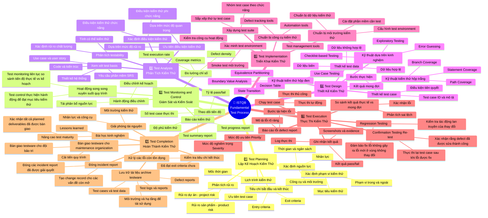

```mermaid
mindmap
  root((🧪 ISTQB<br/>Fundamental<br/>Test Process))

    (1️⃣ Test Planning<br/>Lập Kế Hoạch Kiểm Thử)
      Xác định phạm vi kiểm thử
        Mục tiêu kiểm thử
        Phạm vi trong và ngoài
      Phân tích rủi ro
        Rủi ro sản phẩm - product risk
        Rủi ro dự án - project risk
      Xác định nguồn lực
        Nhân lực
        Công cụ và môi trường
        Thời gian và ngân sách
      Lịch trình kiểm thử
        Ưu tiên test case
        Mốc thời gian
      Tiêu chí bắt đầu và kết thúc
        Entry criteria
        Exit criteria

    (2️⃣ Test Monitoring and Control<br/>Giám Sát và Kiểm Soát)
      Hoạt động song song xuyên suốt quy trình
        Test monitoring liên tục so sánh tiến độ thực tế vs kế hoạch
        Test control thực hiện hành động để đạt mục tiêu kiểm thử
      Theo dõi tiến độ
        Số test case thực thi
        Tỷ lệ pass/fail
        Độ phủ kiểm thử
      Đo lường chỉ số
        Defect density
        Test execution rate
        Coverage metrics
      Báo cáo kiểm thử
        Test progress report
        Test summary report
      Hành động điều chỉnh
        Điều chỉnh kế hoạch
        Tái phân bổ nguồn lực

    (3️⃣ Test Analysis<br/>Phân Tích Kiểm Thử)
      Xem xét test basis
        Yêu cầu phần mềm SRS
        Thiết kế hệ thống
        Use case và user story
        Code và kiến trúc
      Xác định điều kiện kiểm thử
        Điều kiện kiểm thử chức năng
        Điều kiện kiểm thử phi chức năng
      Phân tích testability
        Tính có thể kiểm thử
        Xác định rủi ro chất lượng
      Ưu tiên điều kiện kiểm thử
        Dựa trên mức độ rủi ro
        Dựa trên mức độ quan trọng

    (4️⃣ Test Design<br/>Thiết Kế Kiểm Thử)
      Kỹ thuật kiểm thử hộp đen
        Equivalence Partitioning
        Boundary Value Analysis
        Decision Table
        State Transition
        Use Case Testing
      Kỹ thuật kiểm thử hộp trắng
        Statement Coverage
        Branch Coverage
        Path Coverage
      Kỹ thuật dựa trên kinh nghiệm
        Error Guessing
        Exploratory Testing
        Checklist-based Testing
      Thiết kế test case
        Test case ID và mô tả
        Điều kiện tiên quyết
        Bước thực hiện
        Kết quả mong đợi
      Thiết kế test data
        Dữ liệu hợp lệ
        Dữ liệu không hợp lệ
        Dữ liệu biên

    (5️⃣ Test Implementation<br/>Triển Khai Kiểm Thử)
      Xây dựng test suite
        Sắp xếp thứ tự test case
        Nhóm test case theo chức năng
      Chuẩn bị môi trường kiểm thử
        Cài đặt phần mềm cần test
        Cấu hình test environment
        Chuẩn bị dữ liệu kiểm thử
      Chuẩn bị công cụ kiểm thử
        Test management tools
        Automation tools
        Defect tracking tools
      Xác minh test environment
        Smoke test môi trường
        Kiểm tra công cụ hoạt động

    (6️⃣ Test Execution<br/>Thực Thi Kiểm Thử)
      Chạy test case
        Thực thi thủ công
        Thực thi tự động
      Ghi nhận kết quả
        Kết quả pass/fail
        Log thực thi
        Screenshots và evidence
      So sánh kết quả thực tế vs mong đợi
        Phân tích sai lệch
        Xác nhận lỗi
      Báo cáo lỗi defect report
        Mô tả lỗi rõ ràng
        Mức độ nghiêm trọng Severity
        Mức độ ưu tiên Priority
        Bước tái hiện lỗi
      Confirmation Testing Re-test
        Thực thi lại test case sau khi lỗi được fix
        Xác nhận rằng defect đã được sửa thành công
      Regression Testing
        Đảm bảo fix lỗi không gây ra lỗi mới ở vùng không thay đổi
        Kiểm tra tác động lan truyền của thay đổi

    (7️⃣ Test Completion<br/>Hoàn Thành Kiểm Thử)
      Kiểm tra tiêu chí kết thúc
        Đã đạt exit criteria chưa
        Xử lý các lỗi còn tồn đọng
      Đóng incident report
        Đóng các incident report đã được giải quyết
        Tạo change record cho các vấn đề còn mở
      Lưu trữ tài liệu archive testware
        Test cases và test data
        Test logs và reports
        Defect reports
        Môi trường và hạ tầng để tái sử dụng
      Bàn giao testware cho maintenance organization
        Bàn giao testware cho đội bảo trì
        Xác nhận tất cả planned deliverables đã được bàn giao
      Bài học kinh nghiệm
        Lessons learned
        Cải tiến quy trình
        Nâng cao test maturity
      Giải phóng tài nguyên
        Môi trường kiểm thử
        Nhân lực và công cụ
```