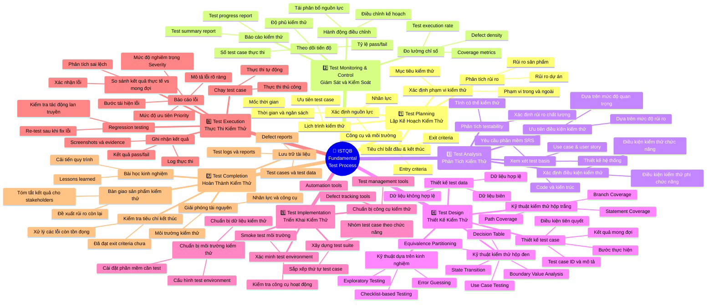

# 🧪 Quy Trình Kiểm Thử Cơ Bản ISTQB

> Sơ đồ tư duy mô tả **ISTQB Fundamental Test Process** — bao gồm 5 giai đoạn chính từ lập kế hoạch đến kết thúc kiểm thử.

---

---

## 📋 Tóm Tắt Các Giai Đoạn

| # | Giai Đoạn | Mục Tiêu Chính |
|---|-----------|----------------|
| 1 | **Test Planning** | Xác định phạm vi, nguồn lực, lịch trình và tiêu chí kiểm thử |
| 2 | **Test Monitoring & Control** | Theo dõi tiến độ và điều chỉnh kế hoạch kịp thời |
| 3 | **Test Analysis** | Phân tích yêu cầu để xác định *cần kiểm thử cái gì* |
| 4 | **Test Design** | Thiết kế test case và test data — *kiểm thử như thế nào* |
| 5 | **Test Implementation** | Chuẩn bị môi trường, dữ liệu và công cụ thực thi |
| 6 | **Test Execution** | Chạy kiểm thử, ghi nhận kết quả và báo cáo lỗi |
| 7 | **Test Completion** | Đánh giá hoàn tất, lưu trữ tài liệu và rút kinh nghiệm |

> 💡 **Lưu ý:** Theo ISTQB, **Test Monitoring & Control** là hoạt động diễn ra **xuyên suốt** toàn bộ quy trình, không phải chỉ ở một giai đoạn riêng lẻ.

