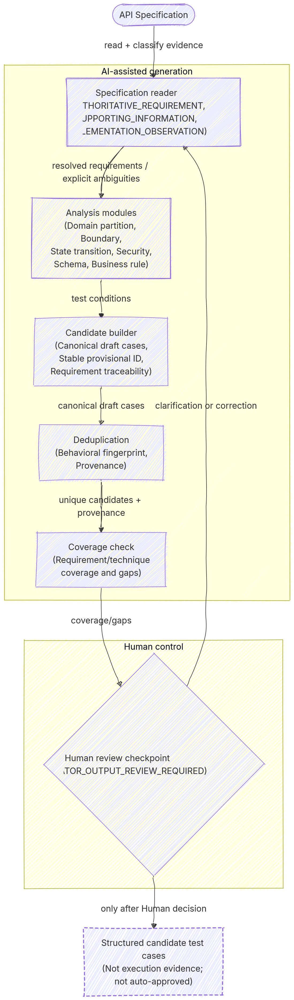

# Báo cáo chính HW06 — API Testing

## 0. Thông tin sinh viên

| Trường | Giá trị |
| --- | --- |
| Sinh viên | Nguyễn Huy Quân |
| MSSV | 23127107 |
| Lớp / Khóa | 23CLC (K23 – Chương trình Chất lượng cao) |
| Học phần | CS423 / CSC13003 — Software Testing |
| Ngày nộp artifact | 2026-08-24 |
| Tự đánh giá | `SelfAssessedGrade = 100` (`100/100`) |
| Tên ZIP dự kiến | `23127107_HW06_AI_API_100.zip` |

## Repository and External Links

- **Primary submission repository:** [https://github.com/Willpact/Hcmus-Software_Testing-HW](https://github.com/Willpact/Hcmus-Software_Testing-HW). Đây là repository chứa Agent Skills, testcase, Postman artifact, Newman evidence, report, CI/CD và tài liệu HW06.
- **SUT / GitHub Issues repository:** [https://github.com/DuyITLOR/group05_eshop](https://github.com/DuyITLOR/group05_eshop). Repository này chỉ được dùng làm SUT/GitHub Issues; nó không chứa bộ artifact nộp HW06.
- **HW06 defect Issues:** chín link trực tiếp #393–#401 được lưu tại `docs/defects/github-issue-readiness.md` và được đối chiếu online theo title bốn tag; mỗi link tương ứng một confirmed root defect.

## 1. Phạm vi và nguồn sự thật

HW06 kiểm thử ba API của EShop: Password Reset (API-01), Checkout (API-02) và Import Products (API-03). Báo cáo này tổng hợp artifact có thật trong workspace. Final reconciliation dùng bộ requirement HW06 đã được Human xác nhận; không suy diễn thêm yêu cầu ngoài bộ requirement đó.

## 2. Requirement Analysis và thiết kế testcase

- Requirement analysis: `docs/requirement-analysis/api-01-reset-password.md`, `api-02-checkout.md`, `api-03-import-products.md`.
- AI tạo 120 candidate testcase (40/API). Human AI Test Audit phân loại raw candidate thành 69 `VALID`, 4 `INVALID` và 47 `INCOMPLETE`. Sau correction/salvage có 78 AI testcase executable; sinh viên bổ sung 15 testcase; suite executable có 93 testcase (API-01: 30, API-02: 30, API-03: 33). 38 candidate được deferred và 4 candidate bị phân loại invalid, không bị biến thành kết quả thực thi.
- Traceability, kỹ thuật kiểm thử và phân loại được giữ trong `test-cases/final/` và `docs/test-suite/final-executable-suite.md`.

## 3. Postman và Newman

Collection, environment mẫu không chứa secret và data files nằm trong `postman/`. Static validation xác nhận 103 request Postman (93 testcase + 10 setup helper), tất cả đều có `X-Student-Id` theo manifest mà không hiển thị giá trị nhạy cảm.

Hai execution artifact thật là `test-results/hw06/run-001/` và `test-results/hw06/run-002/`. `run-001` có 103 request collection và 2 postcheck read-only; `run-002` là rerun có mục tiêu 37 identity. Cả hai Newman report có **0 script/assertion failure**. Kết quả `FAIL` trong tài liệu là business/state verdict từ oracle và external verification, không phải Newman assertion failure. Các report gốc giữ nguyên nhưng có JWT/request credential lịch sử; package dùng bản sao redacted xác định tại `docs/execution-results/redacted-newman/` cùng hash manifest, nên không thay đổi execution evidence hoặc đưa credential vào archive.

| Run | Phạm vi | Business/state outcome |
| --- | --- | --- |
| `run-001` | 93 identity ổn định | 27 PASS, 38 FAIL, 27 BLOCKED, 1 external-pending trước triage |
| `run-002` | 37 identity có mục tiêu | 15 PASS, 21 FAIL, 1 BLOCKED |

Tổng hợp cuối cùng xác nhận 9 root Product Defects; 38 evidence record là testcase evidence cho 9 defect, không phải 38 bug riêng.

## 4. Excel testcase và test summary

Workbook bắt buộc [HW06-Test-Cases-and-Summary.xlsx](HW06-Test-Cases-and-Summary.xlsx) chứa đủ 93 final executable testcase, `Test Summary` tách riêng accounting của `run-001` và `run-002`, cùng sheet 9 defect. Workbook lấy dữ liệu trực tiếp từ `test-cases/final/*.json`, `test-cases/audited/cross-api-summary.json`, `cross-api-final-summary.json` và `case-accounting.json` của hai run; không chứa test-data secret, credential, token hoặc Student ID value. Primary-case mapping của 9 defect đã được Human xác nhận và đối chiếu 9/9 với `docs/defects/evidence-matrix.md`; 38 là số evidence testcase record cho 9 defect, không phải 38 defect.

## 5. Business/state verification và defect evidence

Matrix `docs/defects/evidence-matrix.md` là mapping chính thức. Có 9 report `docs/defects/DEF-*.md` và 17 ảnh genuine đã kiểm tra: 9 request/response evidence và 8 external/state evidence trong `docs/defects/screenshots/`. Capture dùng safe extraction từ artifact thật, terminal Windows thật và native pixel capture; các screenshot không hiển thị Student ID, token, password hoặc password hash.

Các defect bao phủ: client-trusted checkout total, cart không bị xóa, Bearer scheme không bị bắt buộc, import nhận giá không dương, import không atomic, thiếu kiểm tra Admin, reset thiếu mật khẩu mới, bỏ qua password strength, và plaintext password persistence. Root cause/classification và primary case được giữ nguyên trong từng report.

## 6. GitHub Issues

Đúng 9 issue online đã được map tại repository `DuyITLOR/group05_eshop`: #393 đến #401. Chỉ mục: `docs/defects/github-issue-readiness.md`; draft tiếng Việt: `docs/defects/github-issues/`. Mỗi issue tương ứng một confirmed root defect, không phải một testcase.

## 7. CI/CD

Workflow và traceability nằm ở `docs/ci/hw06-ci-cd.md`. Ba GitHub Actions run genuine đã được kiểm tra trực tiếp qua metadata và safe artifact: normal [#32660557339](https://github.com/Willpact/Hcmus-Software_Testing-HW/actions/runs/32660557339) PASS với 179 request, 116 assertion và 0 assertion failure; `intentional-fail` [#32660601543](https://github.com/Willpact/Hcmus-Software_Testing-HW/actions/runs/32660601543) có 180 request, 117 assertion và **đúng 1 Newman assertion failure** từ testcase CI-only; normal cuối [#32660658460](https://github.com/Willpact/Hcmus-Software_Testing-HW/actions/runs/32660658460) PASS lại với 179/116/0, xác nhận final healthy state. Intentional run có smoke exit 0 và runner/orchestration `INTENTIONAL_FAILURE_VERIFIED`, nên failure không phải infrastructure/configuration error. Các configuration-error run cũ, gồm #32630260002, không được tính làm required failed run.

## 8. Agent Skill, AI Critique và AI Audit

Reusable Agent Skill nằm tại `.agents/api-test-generator/SKILL.md`, có purpose, input/output, workflow, validation, pseudocode, demo và limitations. Final diagram Human-controlled được lưu tại `docs/agent-skill/api-test-generator-diagram.png`; handoff gốc được giữ tại `.agents/api-test-generator/diagram-handoff.md` để traceability. Demo của reusable `api-test-generator`: [HW06 API Testing – Reusable API Test Generator Agent Skill Demo](https://youtu.be/HodItPORCTw). Implementation và video demo là phần khuyến khích; báo cáo không diễn đạt video là yêu cầu bắt buộc.

AI Critique (200–300 từ) ở `docs/final/AI-CRITIQUE.md`. AI Audit append-only ở `docs/ai-audit/AI_AUDIT_LOG.md` đã finalize 22 entry: 19 `VALID`, 0 `INVALID`, 3 `INCOMPLETE` và 0 `PENDING_HUMAN_REVIEW`. Bốn decision A-015/A-016/A-017/A-022 là Human-approved; Student Information, Mandatory Disclosure và Student Confirmation đã được Human cung cấp. A-010 đã chuẩn hóa hai enum field theo schema hiện hành, nhưng giữ nguyên Human Decision Evidence và prompt/output lịch sử.

## Figure — Workflow of the reusable AI-driven API Test Generator Agent Skill

Figure này là final artifact do Human tạo/export bằng Mermaid.io. Nó minh họa luồng từ API Specification qua Specification reader, sáu analysis modules, Candidate builder, Deduplication, Coverage check và Human review checkpoint đến structured candidate test cases; feedback loop clarification/correction quay lại Specification reader. Figure không phải AI-generated diagram và không đại diện execution evidence hoặc approved testcase.

## Self-assessment

`SelfAssessedGrade = 100` (`100/100`) do Human lựa chọn; archive dự kiến là `23127107_HW06_AI_API_100.zip`. Lý do dựa trên artifact đã hoàn tất: đúng ba API; 120 raw AI candidate (40/API), Human AI Test Audit, 15 Student-added case và 93 executable identity; Postman/Newman cùng X-Student-Id integration; 9 defect, 17 screenshot genuine và 9 GitHub Issue; CI PASS → intentional đúng một testcase FAIL → PASS cuối; Excel testcase/summary; reusable Agent Skill, pseudocode, diagram do Human tạo và video demo; AI Critique, AI Audit finalized 22 entry, Git history evidence, report Markdown/PDF. Nhận định này không thay thế Human final visual review.

## 9. Hạn chế và việc cần Human hoàn tất

Git commit log sau final commit và final visual/submission review chưa thể tự xác nhận. Danh sách ngắn chỉ dành cho Human: `docs/final/MORNING-HUMAN-ACTIONS.md`.

## 10. Chỉ mục deliverable

- Execution summary: `docs/execution-results/cross-api-execution-summary.md`
- Defect matrix và capture result: `docs/defects/evidence-matrix.md`, `docs/defects/evidence-capture-result.md`
- Submission readiness: `docs/final/hw06-submission-readiness.md`
- CI handoff: `docs/ci/hw06-ci-cd.md`
- AI critique/audit: `docs/final/AI-CRITIQUE.md`, `docs/ai-audit/AI_AUDIT_LOG.md`
- Human-created Agent Skill diagram: `docs/agent-skill/api-test-generator-diagram.png`
- Agent Skill demo: [https://youtu.be/HodItPORCTw](https://youtu.be/HodItPORCTw)
- PDF report: `docs/final/HW06-MAIN-REPORT.pdf`
- Git commit log: `docs/final/HW06-GIT-COMMIT-LOG.md`
- Final checklist/manifest/secret scan: `docs/final/HW06-SUBMISSION-CHECKLIST.md`, `docs/final/HW06-SUBMISSION-MANIFEST.md`, `docs/final/HW06-SECRET-SCAN.md`
- Human-only final commit plan: `docs/final/HW06-FINAL-COMMIT-PLAN.md`
